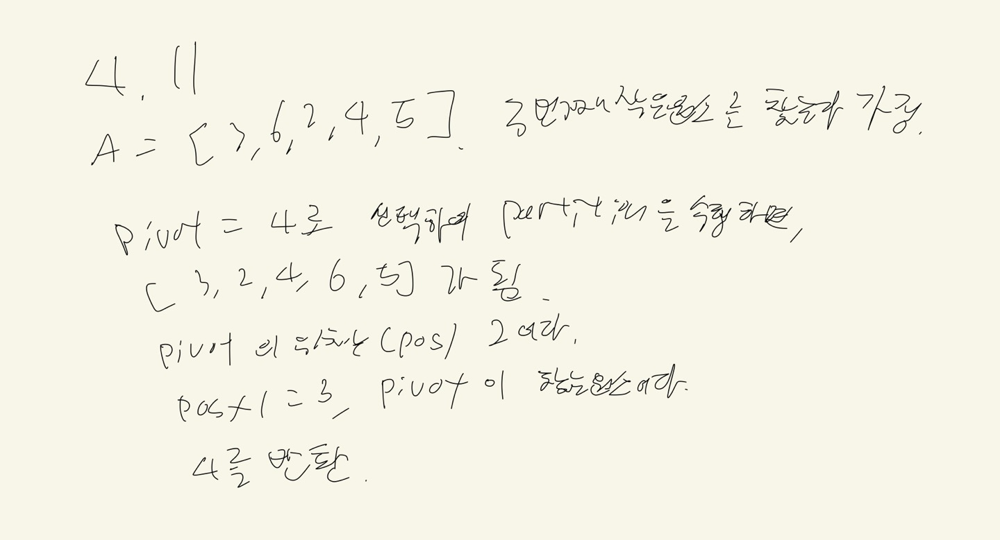

# 1. 문제 정의
이 문제는 주어진 배열에서 k번째로 작은 원소를 찾는 것이다. 이를 위해 Quick Select 알고리즘을 사용한다. 배열 A, 탐색 범위를 나타내는 left와 right, 그리고 찾고자 하는 순서 k가 주어진다

# 2. 알고리즘 설명
Quick Select 알고리즘은 Quick Sort의 아이디어를 사용하여, 평균적으로 O(n)의 시간 복잡도를 가지는 알고리즘이다. 
주어진 배열에서 pivot을 선택하고, 이 pivot을 기준으로 배열을 두 부분으로 나눈다. 
한 부분은 pivot보다 작은 원소들로, 다른 한 부분은 pivot보다 큰 원소들로 구성됩니다. 이 과정을 partition이라고 한다. 
이후, k번째 원소가 어느 쪽에 있는지를 확인하고, 해당 부분에 대해서만 재귀적으로 탐색을 진행함.

# 3. 손으로 푼 예제

# 4. 알고리즘 개요
partition 함수를 사용하여 pivot을 기준으로 배열을 나눕니다.
pos+1이 left+k와 같다면, A[pos]가 k번째로 작은 원소입니다.
pos+1이 left+k보다 크다면, k번째 작은 원소는 pivot의 왼쪽 부분에 있으므로, 왼쪽 부분에 대해 재귀적으로 quick_select를 호출합니다.
pos+1이 left+k보다 작다면, k번째 작은 원소는 pivot의 오른쪽 부분에 있으므로, 오른쪽 부분에 대해 재귀적으로 quick_select를 호출합니다.

# 5. 알고리즘 코드
def quick_select(A, left, right, k):
    pos = partition(A, left, right)
    if(pos+1 ==left+k):
        return A[pos]
    elif (pos+1 > left+k):
        return quick_select(A, left, pos-1, k)
    else:
        return quick_select(A, pos+1, right, k-(pos+1-left))
# 6. 테스트 코드
array = [12,3,5,7,4,19,23,15]
print("입력 리스트 =", array)
print("[정렬기법] 3번째 작은 수:", kth_smallest_sort(array, 3))
print("[정렬기법] 6번째 작은 수:", kth_smallest_sort(array, 6))
# 7. 수행 결과

# 8. 복잡도 분석
리스트의 길이 n만큼 시행하는 함수 이기 때문에 복잡도는 O(n) 이다.

# 9. 조별 협력 내용
서강찬(4.1, 4.2) 홍민기(4.3, 4.4) 주동현(4.10, 4.11, 4.12) 김민상(4.5, 4.6, 4.7, 4.8)