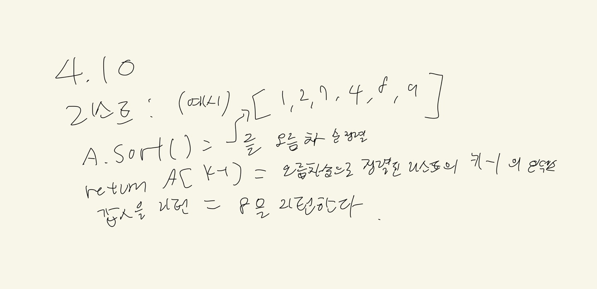
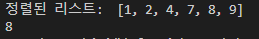

# 1. 문제 정의
# 키를 받아 리스트 안의 내용에서 키 번째로 작은 수를 반환하는 프로그램
# 2. 알고리즘 설명
# 키와 리스트를 입력받아 리스트 정렬 후, 리스트 내에서 키 번째로 작은 수를 반환한다.
# 3 손으로 푼 예제

# 4. 알고리즘 개요
# A = 정렬되지 않은 리스트이다, Key = 번째로 작은 수를 찾는 변수
# 5. 알고리즘 코드 
def kth_smallest_sort(A, k):
    A.sort()
    return A[k-1]
# 6. 테스트 코드
alist = [1,2,7,4,8,9]
print("정렬된 리스트: ", sorted(alist))
print(kth_smallest_sort(alist, 5)) # 5번째로 작은수 찾기
# 7. 수행 결과

# 8. 복잡도 분석
# 리스트의 길이 n만큼 시행하는 함수 이기 때문에 복잡도는 O(n) 이다. 
# 9. 조별 협력 내용
# 서강찬(4.1, 4.2) 홍민기(4.3, 4.4) 주동현(4.10, 4.11, 4.12) 김민상(4.5, 4.6, 4.7, 4.8)