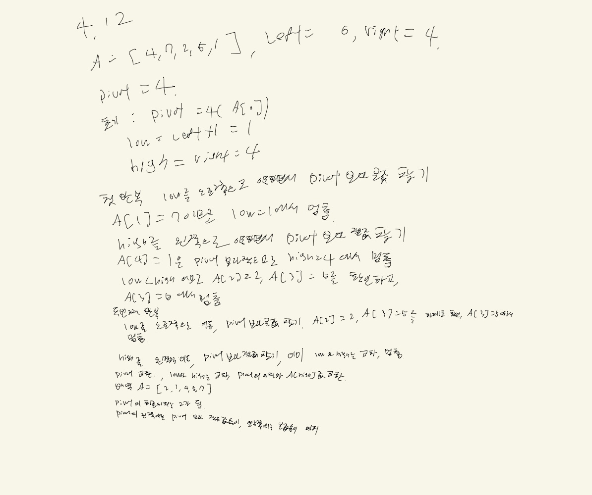

# 1. 문제 정의
입력된 배열 A에서 left와 right 사이의 범위를 대상으로 하여 pivot을 기준으로 배열을 두 부분으로 나눕니다. pivot보다 작은 요소들은 모두 pivot의 왼쪽에, pivot보다 큰 요소들은 모두 pivot의 오른쪽에 위치하도록 배열을 재배치하는 과정을 구현합니다.

# 2. 알고리즘 설명

배열의 첫 번째 요소를 pivot으로 선택합니다.
low 포인터는 배열의 왼쪽 끝에서 시작하여 오른쪽으로 이동하며 pivot보다 큰 요소를 찾습니다.
high 포인터는 배열의 오른쪽 끝에서 시작하여 왼쪽으로 이동하며 pivot보다 작은 요소를 찾습니다.
low와 high가 교차하지 않는 경우 두 요소의 위치를 서로 바꿉니다.
교차하는 시점에서 high와 pivot의 위치를 바꿉니다. 이로써 pivot은 최종 위치에 도달하며, pivot의 왼쪽에는 pivot보다 작은 요소들이, 오른쪽에는 pivot보다 큰 요소들이 위치하게 됩니다.
# 3. 손으로 푼 예제

# 4. 알고리즘 개요
Partition 과정은 배열을 pivot을 기준으로 두 부분으로 나누는 과정이다. 이 과정은 Quick Sort와 Quick Select 알고리즘에서 중요한 역할을 함

# 5. 알고리즘 코드
def partition(A, left, right):
    low = left +1
    high = right
    pivot = A[left]
    while(low<=high):
        while low <= right and A[low] <= pivot: low+=1
        while high >= left and A[high] > pivot: high-=1
        if low<high:
            A[low], A[high] = A[high], A[low]
    A[left], A[high] = A[high], A[left]
    return high

# 6. 테스트 코드
A = [4, 7, 2, 5, 1]
print("Before partition:", A)
pivot_index = partition(A, 0, len(A)-1)
print("After partition:", A)
print("Pivot's final position:", pivot_index)
# 7. 수행결과

# 8. 복잡도 분석
Partition 함수의 시간 복잡도는 O(n)이다. 여기서 n은 left와 right 사이의 요소 수. 모든 요소를 한 번씩 검사하기 때문이다. 이 과정은 배열의 크기에 비례하는 시간 걸림

# 9. 조별 협력 내용
서강찬(4.1, 4.2) 홍민기(4.3, 4.4) 주동현(4.10, 4.11, 4.12) 김민상(4.5, 4.6, 4.7, 4.8)