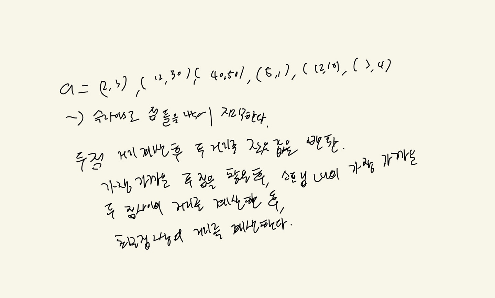
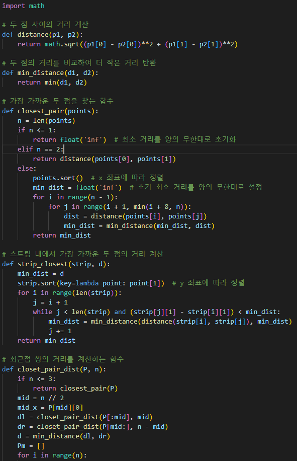
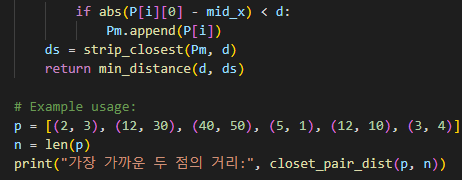
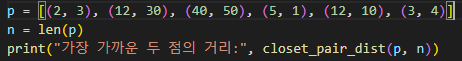
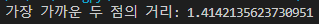

# 5.9
# 1. 문제 정의
분할정복 기법으로 만든 최근접 쌍의 거리 프로그램
# 2. 알고리즘 설명
리스트를 왼쪽과 오른쪽으로 나누어 각각 최근접 쌍의 거리를 구한다
# 3. 손으로 푼 예제

# 4. 코드 개요
P = 점의 리스트, n = 점의 갯수, 이때 P는 X축 기준으로 오름차순 정렬되있어야 한다.
# 5. 코드

# 6. 테스트 코드

# 7. 수행 결과

# 8. 복잡도 분석
O((nlog2n)^2)
# 9. 협력 내용
5.1 5.2 5.3 5.4 서강찬
5.5 5.6 5.7 홍민기
5.8 김민상
5.9 주동현
상호 지도