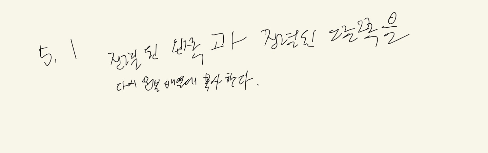
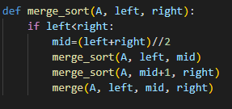

# 5.1
# 1. 문제 정의
병합 정렬의 병합 부분 코드이다
# 2. 알고리즘 설명
중간 부분을 중간 + 왼쪽, 중간+오른쪽을 나누어 2개의 리스트로 정렬을 한다.
# 3. 손으로 푼 예제

# 4. 코드 개요
A = 입력 리스트, left와 right는 리스트 내의 정렬하고자 하는 시작 항목과 끝 인덱스 이다.
# 5. 코드

# 6. 테스트 코드

# 7. 수행 결과

# 8. 복잡도 분석
5.1은 O(1) 이다.
# 9. 협력 내용
5.1 5.2 5.3 모두 팀원들이랑 같이 풀었다.