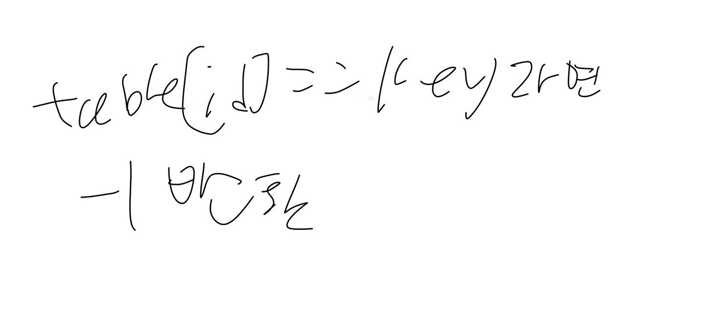

# 6.8
# 1. 문제 정의
선형조사법의 삭제 알고리즘
# 2. 알고리즘 설명
해당 버킷에 찾는 키가 있으면 그 항목을 삭제한다. None으로 처리하지 않고 -1로 처리했다. 이것은 사용되었다가 삭제된 버킷을 의미 한다.
# 3. 손으로 푼 예제

# 4. 코드 개요
해시 함수 적용: 삭제하고자 하는 키(key)에 해시 함수(hashfn)를 적용해 해당 키가 저장되어야 할 인덱스(id)를 계산함.

탐색: 해시 테이블(table)에서 계산된 인덱스(id)부터 시작하여 테이블을 선형으로 탐색함. 이 때, 최대 M번까지만 탐색하도록 count 변수를 사용하여 탐색 횟수를 제한함.

조건 확인 및 삭제: 탐색 도중, 만약 해당 인덱스에 값이 None이면, 키가 테이블에 없다는 의미이므로 함수를 종료함. 만약 탐색한 위치의 값이 -1이 아니면서 삭제하고자 하는 키와 일치한다면, 해당 위치의 값을 삭제하고 함수를 종료함.

인덱스 갱신: 탐색 중에 삭제할 키를 찾지 못하고 다음 위치로 이동해야 한다면, 인덱스를 하나 증가시키고(id=(id+1+M) % M), M을 넘지 않도록 모듈로 연산함. 이 과정을 통해 인덱스가 해시 테이블의 범위를 벗어나지 않도록 함.

탐색 횟수 감소: 탐색을 한 번 할 때마다 count를 하나씩 감소시킴. count가 0이 되면, 테이블 전체를 탐색했음에도 불구하고 키를 찾지 못한 것이므로 함수를 종료함.
# 5. 코드

# 6. 테스트 코드

# 7. 수행 결과

# 8. 복잡도 분석
최악의 경우 복잡도: O(M)
평균 경우 복잡도: 일반적으로 O(1)
# 9. 협력 내용
6.4, 6.7 서강찬
6.6, 6.2 김민상
6.1, 6.3 홍민기
6.8, 6.9 주동현
상호 지도