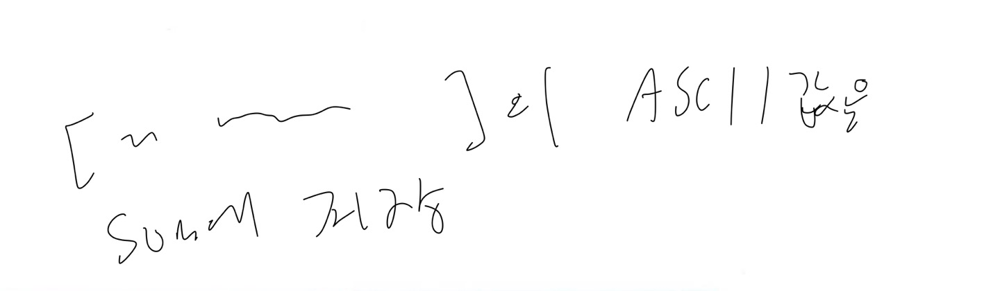
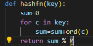
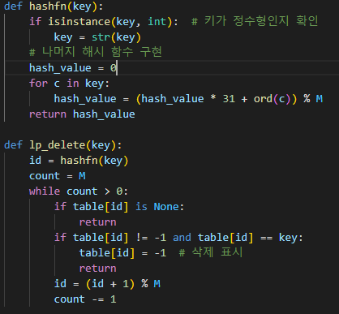
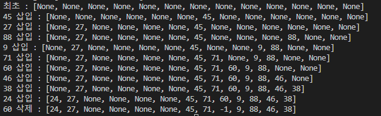

# 6.9
# 1. 문제 정의
문자열의 모든 문자에 대헤 아스키코드 값을 모두 sum에 더한다
# 2. 알고리즘 설명
문자열의 모든 문자에 대헤 아스키코드 값을 모두 sum에 더해 해시 함수를 계산하는 함수
# 3. 손으로 푼 예제

# 4. 코드 개요
key의 각 문자에 대해 해당 문자의 ASCII 값을 sum에 더함 
sum을 해시 테이블의 크기 M으로 나눈 나머지 반환
# 5. 코드

# 6. 테스트 코드

# 7. 수행 결과

# 8. 복잡도 분석
최악의 경우 복잡도: O(M)
평균 경우 복잡도: 일반적으로 O(1)
# 9. 협력 내용
6.4, 6.7 서강찬
6.6, 6.2 김민상
6.1, 6.3 홍민기
6.8, 6.9 주동현
상호 지도