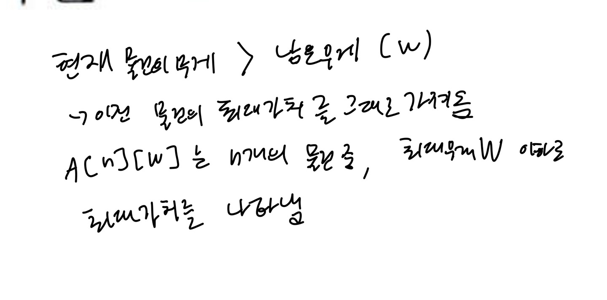
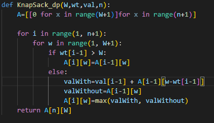
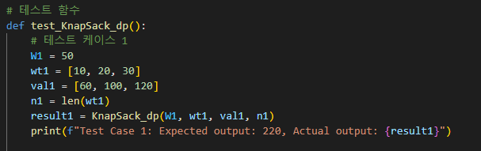

# 7.5
# 1. 문제 정의
0-1 배낭채우기 알고리즘(동적계획법)
# 2. 알고리즘 설명
n=4이면 리스트 앞쪽 네개의 물건만 고려하여 배낭에 넣는다.
# 3. 손으로 푼 예제

# 4. 코드 개요
W: 배낭의 최대 무게 (capacity).
wt: 물건들의 무게 리스트 (weights).
val: 물건들의 가치 리스트 (values).
n: 물건의 개수 (number of items).
# 5. 코드

# 6. 테스트 코드

# 7. 수행 결과

# 8. 복잡도 분석
무게 한도 W와 물건의 수 n에 비례하여 실행 시간과 메모리 사용량이 증가함. 이는 재귀적 접근 방식보다 효율적, 특히 큰 입력에 대해서도 성능이 뛰어남.
# 9. 협력 내용
김민상 7.2
주동현 7.5, 7.6
홍민기 7.1
서강찬 7.10
상호 지도