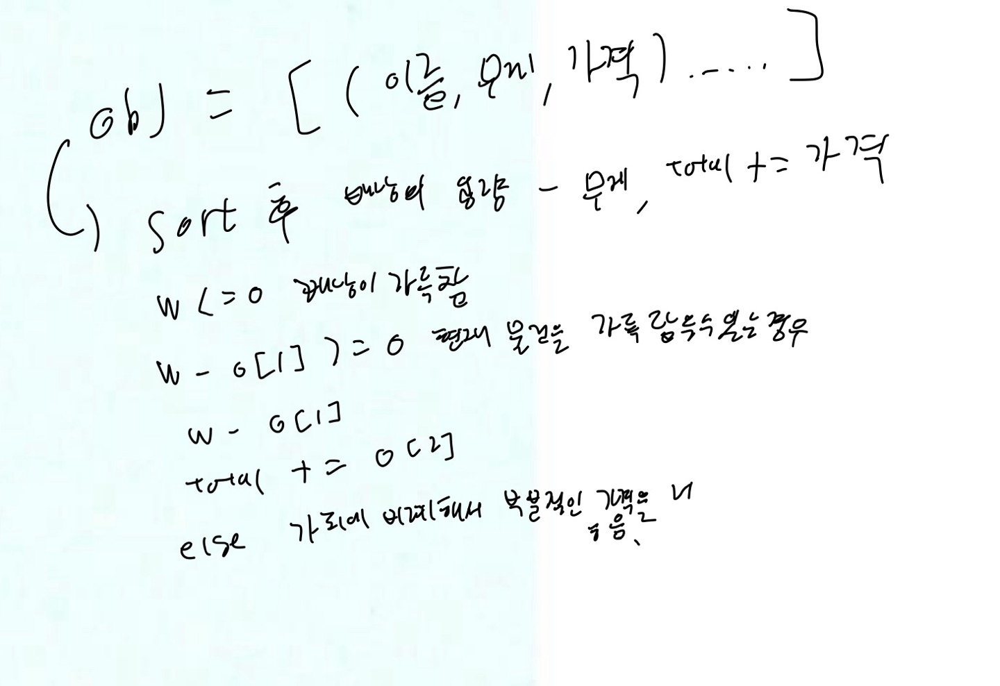
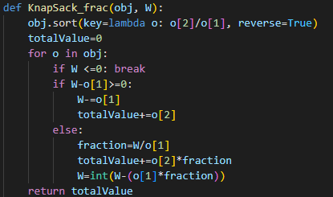
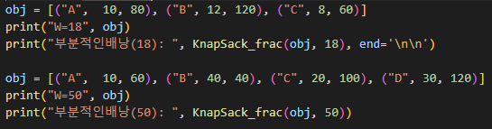
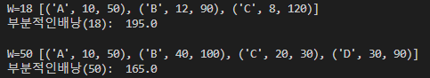

# 8.2
# 1. 문제 정의
0-1 배낭채우기 알고리즘(탐욕적기법)
# 2. 알고리즘 설명
n=4이면 리스트 앞쪽 네개의 물건만 고려하여 배낭에 넣는다.
# 3. 손으로 푼 예제

# 4. 코드 개요
W: 배낭의 최대 무게 (capacity).
obj = 물건들의 리스트(물건, 무게, 가치)
# 5. 코드

# 6. 테스트 코드

# 7. 수행 결과

# 8. 복잡도 분석
obj.sort(key=lambda o: o[2]/o[1], reverse=True)은 O(n log n)이고, 루프의 복잡도는 O(n)이다. O(n log n) + O(n) = O(n log n)이다.
# 9. 협력 내용
김민상 8.8,8.9
주동현 8.2
홍민기 8.1
서강찬 8.5
상호 지도